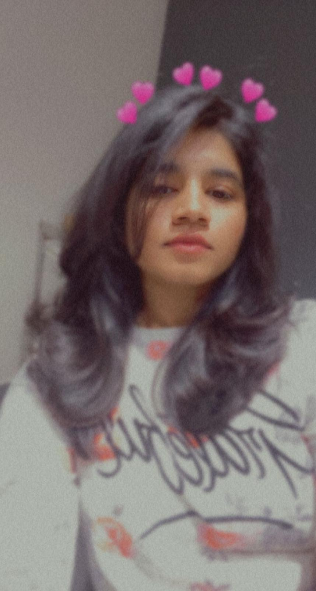

# Vamshika Dasari
I am from most popular country in the world that is INDIA. I am Ambivert and want to be independent. Happiness looks gergeous on me. I love photography and travelling. I like chocolates and pizza.I came to USA for my master's.



*******

# Country Table

|Country Name    |   Reason                      | Time to spent(Days)
|----------------|:-----------------------------:|------------------:|
|Paris           |For site seeing and crossiants | 15-20days         |
|Maldives        |For best snorkelling and diving| 10-15days         |
|America         |To experience culture          | 1 month           |
|Indonesia       |Beaches and magical temples    | 20 days           |

********

# Quotes

> Even in hard times there's a possibility to have fun. _Vamshika_

> Live for today and let tomorrow come later. _Vamshika_

*******

> SVG Patterns

```php

<svg style='display: block; height: 60px; width: 95px; '>
    <defs>
        <pattern patternUnits='userSpaceOnUse' viewBox='0 0 20 20' width='20'  height='20' id='the_pattern'>
            <circle cx='10' cy='10' r='10' stroke-width='0' fill='black'></circle>
        </pattern>
    </defs>

    <rect x='0' y='0' width='80' height='20' fill='url(#the_pattern)'></rect>
    <rect x='0' y='20' width='90' height='20' fill='url(#the_pattern)'></rect>
    <rect x='0' y='40' width='95' height='20' fill='url(#the_pattern)'></rect>

</svg>


```

Answer Query

```php

>svg width="100%" height="100%">
  
  <!-- Create mask that we'll use to define a slight gradient -->
  <mask maskUnits="userSpaceOnUse" id="fade">
    <!-- Here's that slight gradient -->
     	<linearGradient id="gradient" x1="0" y1="0" x2="0" y2="100%">
      <stop offset="0" style="stop-color: #FFFFFF"></stop>
      <stop offset="1" style="stop-color: #000000"></stop>
    </linearGradient>
    <!-- The canvas for our mask -->
    <rect fill="url(#gradient)" width="100%" height="100%"></rect>
  </mask>
    
  <!-- Let's define the pattern -->
  <!-- The width and height should be double the circle radius we plan to use -->
  <pattern id="pattern-circles" x="0" y="0" width="40" height="40" patternUnits="userSpaceOnUse">
    <!-- Now let's draw the circle -->
    <!-- We're going to define the `fill` in the CSS for flexible use -->
    <circle mask="url(#fade)" cx="20" cy="20" r="20"></circle>
  </pattern>
  <!-- The canvas with our applied pattern -->
  <rect x="0" y="0" width="100%" height="100%" fill="url(#pattern-circles)"></rect>
  
</svg>

```

[Link](https://css-tricks.com/snippets/svg/svg-patterns/)


